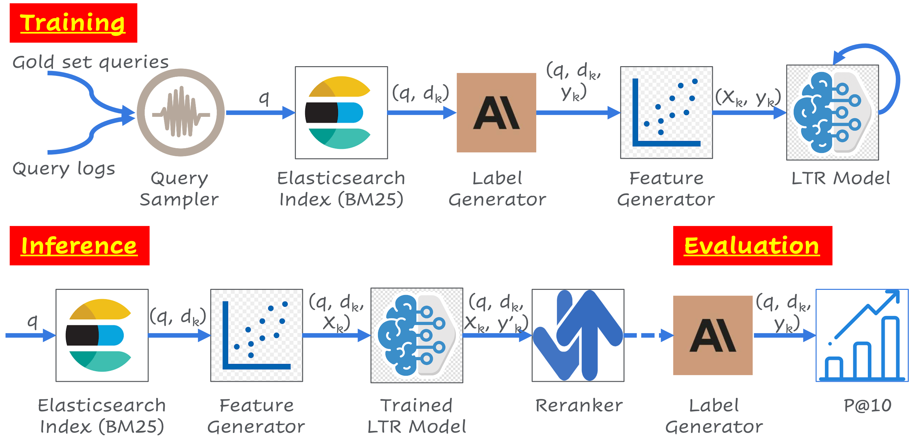
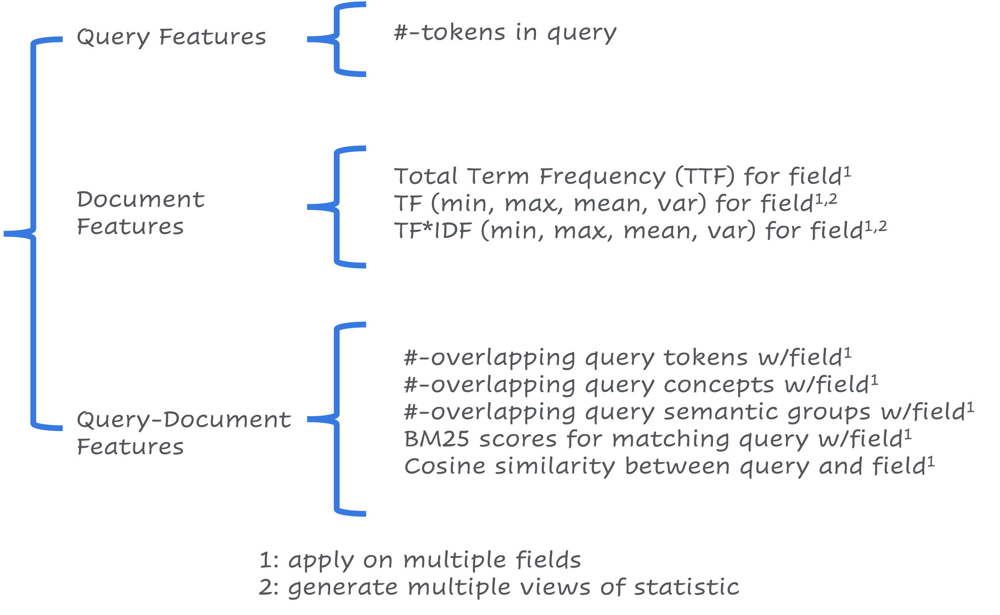
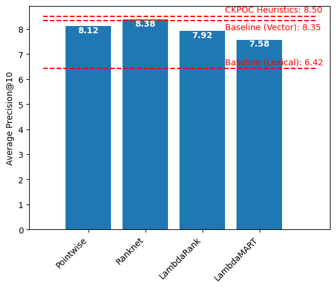
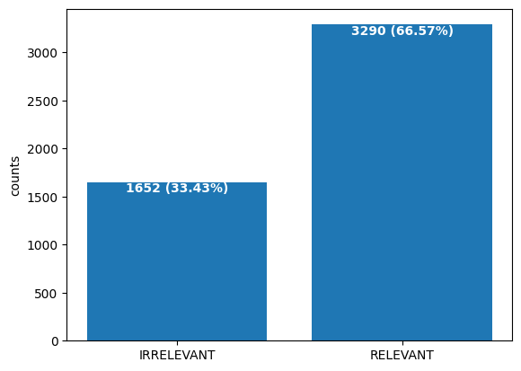
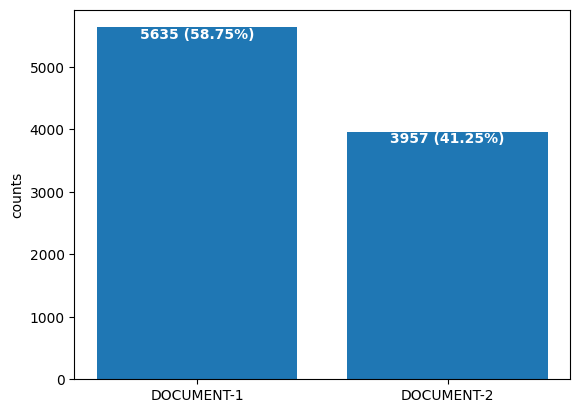
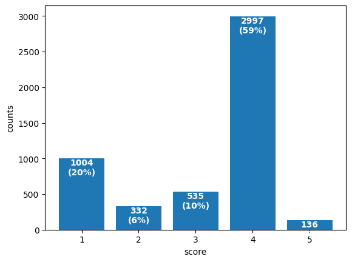

# Building Learning to Rank (LTR) search reranking models using Large Language Models (LLM)

This repository contains code for a case study where Large Language Models were used to generate query-document relevance judgements; these judgements were then used to train Learning to Rank models for reranking search results from an untuned search ngine, resulting in almost 20% increase in Mean Average Precision (MAP@10).

_**PLEASE NOTE:** The code in this repository is being provided as-is without any warranty of any kind. While efforts have been made to ensure that the instructions are accurate, some of the underlying software libraries move on a fast update cycle and may have changed, and as a result the code may neither be installable or executable. It is being provided for study purposes only._

## Abstract

Search engineers have many tools to address relevance. Older tools are typically unsupervised (statistical, rule based) and require large investments in manual tuning effort. Newer ones involve training or fine-tuning machine learning models and vector search, which require large investments in labeling documents with their relevance to queries.

Learning to Rank (LTR) models are in the latter category. However, their popularity has traditionally been limited to domains where user data can be harnessed to generate labels that are cheap and plentiful, such as e-commerce sites. In domains where this is not true, labeling often involves human experts, and results in labels that are neither cheap nor plentiful. This effectively becomes a roadblock to adoption of LTR models in these domains, in spite of their effectiveness in general.

Generative Large Language Models (LLMs) with parameters in the 70B+ range have been found to perform well at tasks that require mimicking human preferences. Labeling query-document pairs with relevance judgements for training LTR models is one such task. Using LLMs for this task opens up the possibility of obtaining a potentially unlimited number of query judgment labels, and makes LTR models a viable approach to improving the site’s search relevancy.

In this presentation, we describe work that was done to train and evaluate four LTR based re-rankers against lexical, vector, and heuristic search baselines. The models were a mix of pointwise, pairwise and listwise, and required different strategies to generate labels for them. All four models outperformed the lexical baseline, and one of the four models outperformed the vector search baseline as well. None of the models beat the heuristics baseline, although two came close – however, it is important to note that the heuristics were built up over months of trial and error and required familiarity of the search domain, whereas the LTR models were built in days and required much less familiarity.

## Architecture and Workflow

This is a supervised learning pipeline, even though labels are generated by prompting LLMs rather than human experts, hence we show the training, inference and evaluation pipelines separately.

The main components of the pipeline are as follows:

* **Query Sampler** -- filter query logs to find appropriate queries to train LTR relevance models for. Alternate implementations could use question answering on the corpus to generate potential queries.
* **Label Generator** -- prompts LLMs (in this case Anthropic's Claude) with a (query, document) pair or (query, document-1, document-2) triple to predict if document is relevant or which document is more relvant to the query respectively.
* **Feature Generator** -- "manual" feature generation using various techniques involving Elasticsearch index, Vector Similarity, Knowledge Graph, etc, to convert incoming (query, document) pair or (query, document-1, document-2) triple into numeric feature vector. The features generated are summarized in the figure below. Alternate implementations could involve using appropriate third-party embedding models to generate a feature vector.
* **LTR Model(s)** -- a model that takes a feature vector and predicts a numeric score indicating the relevance of a document to a query or the relevance ranking of a pair of documents against a query. Four types of LTR models were trained, a pointwise regression model, and pairwise models RankNet, LambdaRank and LambdaMART. (_**Note** that these are standalone external models, we do not integrate with Elasticsearch's LTR plugin_).

During training, we sample our query logs to find a set of candidate queries. We then generate (top 10 or 20) results from an untuned Elasticsearch index to construct (query, document) pairs or (query, document-1, document-2) triples for RankNet and prompt an LLM to produce judgments. We then use these pairs (or pairs generated from triples) to construct feature vectors for each (query, document) pair. These feature vectors are used to train the LTR model, which is also the output of the training pipeline.

During inference, we send queries into the untuned Elasticsearch index and generate results for typically the top 50 or 100. Each (query, document) pair is then scored using the trained LTR and the results reranked. In case of the RankNet model, we score all possible pairs of documents, i.e., for N results we would do `N*(N-1)/2` comparisons using the trained LTR model and rerank using the reranking step shown here. The top 10 reranked results are returned to the user.

During evaluation, we augment the inference pipeline with an evaluation step. For a fixed subset of queries, we generate results from the inference pipeline using a pipeline of an untuned Elasticsearch index followed by the trained LTR reranker under evaluation, and score the results using Precision@10. We then average this score across all queries in the fixed subset, giving us Mean Average Precision (MAP@10) to score our LTR model with. Note that human labels are _not required_ for the query subset, the MAP@10 metric compares different models. Note also that the output of the LTR reranking step includes scores, so while we chose the rank-agnostic MAP@10 in this application, we could also generate rank-aware metrics such as NDCG@10 if needed.

## Results

Results of our experiments are summarized in the diagram below. Horizontal dotted lines represent baselines using existing (non-LTR) strategies. Each bar represents a LTR model that was trained using the pipeline.

The same results are presented in tabular form below.

| Type | Model | MAP@10 |
| ---- | ----- | ------ |
| Baseline | BM25 (Elasticsearch OOB) | 6.42 |
| Baseline | Cosine Similarity (QDrant OOB) | 8.35 |
| **Baseline** | **Lexical Heuristics (prop)** | **8.50** |
| LTR Model | Pointwise Regression | 8.12 |
| <ins>_LTR Model_</ins> | <ins>_Pairwise RankNet_</ins> | <ins>_8.38_</ins> |
| LTR Model | Pairwise LambdaRank | 7.92 |
| LTR Model | Pairwise LambdaMART | 7.58 |

The general expectation is that LambdaMART &gt; LambdaRank &gt; RankNet &gt; Pointwise model in terms of performance. However, we noticed that our prompting strategy for generating 1-5 numeric score judgments for LambdaRank and LambdaMART produced a relatively unbalanced class distribution compared to the class distribution of judgments for the regression and RankNet models. The class distributions are shown below. It seems very likely that the poor performance of LambdaRank and LambdaMART are caused by the quality of the judgment data generated.

<table cellspacing=0 cellpadding=0 border=0>
  <tr>
    <td></td>
    <td></td>
    <td></td>
  </tr>
  <tr>
    <td>Pointwise</td>
    <td>RankNet (paired)</td>
    <td>LambdaRank and LambdaMART (scored)</td>
  </tr>
</table>

## References

* [Large Language Models can accurately predict searcher preferences](https://arxiv.org/abs/2309.10621) (Thomas et al, 2023)
* [Learning to Rank Datasets](https://www.microsoft.com/en-us/research/project/mslr/) (Microsoft Research)
* [From RankNet to LambdaRank to LambdaMart - an Overview](https://www.microsoft.com/en-us/research/uploads/prod/2016/02/MSR-TR-2010-82.pdf) (Burges, 2010)

## Presentations

* Elsevier Search Summit 2023 (internal)
* PyData Global 2023 ([abstract](https://global2023.pydata.org/cfp/me/submissions/ESEDTM/), [slides](https://www.slideshare.net/sujitpal/building-learning-to-rank-ltr-search-reranking-models-using-large-language-models-llm))

